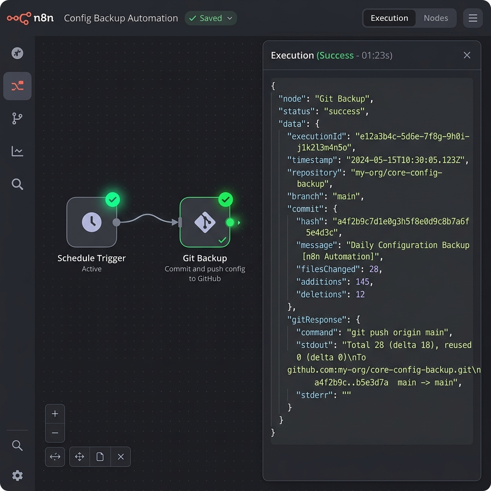

# 📦 n8n-nodes-git-backup

[](https://www.npmjs.com/package/n8n-nodes-git-backup)
[](https://docs.n8n.io/integrations/community-nodes/)
[](LICENSE)

> **Free, automatic, and secure workflow backups directly to GitHub for local, desktop, and self-hosted n8n users.** No enterprise license required.



---

## 💡 The Problem vs. The Solution

### 🔴 The Problem
* **Locked Behind Paywall:** The official Git integration in n8n is an Enterprise/Cloud feature, costing thousands of dollars annually.
* **Manual Exports Are Painful:** Manually downloading JSON files via the GUI is repetitive, tedious, and easy to forget.
* **No Version History:** Modifying automation logic without automated version control is a recipe for lost work.

### 🟢 The Solution (`n8n-nodes-git-backup`)
* **100% Free & Open Source:** Version control backups for local, desktop, and self-hosted n8n instances without paying a cent.
* **Automated & Unattended:** Simply hook the node to a `Schedule Trigger` or an `On Workflow Saved` system to back up files automatically.
* **DevOps Best Practices:** Clean, formatted JSON files are pushed directly to your repository with automated, semantic commit messages.

---

## ⚡ Key Features

* 🔄 **Flexible Backup Scopes:** Back up either the **currently executing workflow** or **all workflows** in a single run.
* 🛡️ **SHA-Aware Conflict Resolution:** Automatically retrieves the remote file's SHA hash prior to committing, preventing push conflicts and overwrite issues.
* 🏷️ **Conventional Commit Messages:** Auto-generates structured commit messages (e.g., `chore(backup): update workflow [Send Invoice] (2026-05-21)`) if no custom message is provided.
* ⏭️ **Continue on Individual Error:** Robust error handling so a failure backing up one workflow won't abort the entire backup sequence.
* 🧹 **Automatic Sanitization:** Converts arbitrary workflow names into safe, web-friendly, lowercase filenames.
* 📦 **Transparent Pagination:** Native support for instances with hundreds of workflows, fetching all definitions dynamically via the n8n REST API.

---

## 📐 How It Works

```mermaid
graph TD
    subgraph Local n8n Instance (Desktop / Docker)
        ST[Schedule Trigger] -->|Triggers Daily| GB[Git Backup Node]
        GB -->|Fetch Definitions| API[n8n REST API]
    end
    subgraph Remote Version Control
        GB -->|1. Get current SHA| GH_API[GitHub Contents API]
        GB -->|2. Push JSON files| GH_API
        GH_API -->|Store & Version| REPO[(GitHub Repository)]
    end
    style Local n8n Instance (Desktop / Docker) fill:#f9f9f9,stroke:#333,stroke-width:2px
    style Remote Version Control fill:#eef,stroke:#333,stroke-width:2px
```

---

## 🚀 Installation

### Option A: Install via n8n GUI (Once Published)
1. In n8n, navigate to **Settings > Community Nodes**.
2. Click **Install a Node**.
3. Type `n8n-nodes-git-backup` into the npm Package Name field.
4. Agree to the risk notice and click **Install**.

---

### Option B: Local Development / Manual Symlink (`npm link`)
If you are developing locally, testing changes, or running n8n Desktop / Docker:

#### 1. Clone & Build the Extension
```bash
git clone https://github.com/dsc2q/n8n-nodes-git-backup.git
cd n8n-nodes-git-backup
npm install
npm run build
```

#### 2. Register the Node Globally
```bash
npm link
```

#### 3. Link it to your n8n Instance

* **For n8n Desktop / Global Installation:**
  Find where your global node modules are located (e.g. `%APPDATA%\npm\node_modules\n8n` on Windows or `/usr/local/lib/node_modules/n8n` on macOS/Linux):
  ```bash
  cd /path/to/global/node_modules/n8n
  npm link n8n-nodes-git-backup
  ```

* **For Docker (docker-compose.yaml):**
  Mount your local development folder directly inside the custom extension directory:
  ```yaml
  services:
    n8n:
      image: n8nio/n8n:latest
      environment:
        - N8N_CUSTOM_EXTENSIONS=/home/node/.n8n/custom
      volumes:
        - n8n_data:/home/node/.n8n
        - /absolute/path/to/n8n-nodes-git-backup:/home/node/.n8n/custom/n8n-nodes-git-backup
  ```

#### 4. Restart n8n
Restart n8n Desktop or run `docker compose restart n8n`. Search for **"Git Backup"** in your node selector. 🎉

---

## ⚙️ Credentials & Setup

Create a new credential of type **"Git Backup (GitHub + n8n API)"** in your n8n dashboard:

| Field Name | Description | Example Value |
|---|---|---|
| **GitHub Token (PAT)** | Personal Access Token with `repo` scope | `ghp_qgNq9ex...` |
| **Repository Owner** | Your GitHub username or organization name | `dsc2q` |
| **Repository Name** | The target repo to store workflow JSONs | `n8n-workflow-backups` |
| **Branch** | Target branch name (must exist beforehand) | `main` |
| **n8n Base URL** | Local/Remote address of your n8n instance | `http://localhost:5678` |
| **n8n API Key** | API Key to read workflow JSON definitions | `n8n_api_9a8f...` |

### 🔑 Generating Keys
1. **GitHub PAT:** Go to [github.com/settings/tokens](https://github.com/settings/tokens) > **Generate new token (classic)** > Select **`repo`** scope > Click **Generate**.
2. **n8n API Key:** In n8n, go to **Settings > Personal Settings > API Keys** > Click **Create API Key**.

---

## ⚙️ Node Parameters

* **Operation:**
  * `Backup Current Workflow`: Backs up only the workflow where this node resides.
  * `Backup All Workflows`: Queries n8n API for all workflows and backs them all up.
* **File Path Prefix:** The folder directory in the repo where files will be stored (e.g., `workflows/`).
* **Commit Message:** Custom commit message. If empty, the node generates a structured Conventional Commit message automatically.
* **Continue on Individual Failure (Backup All only):** Skip faulty workflows and keep backing up others.
* **Backup Active Workflows Only (Backup All only):** Skip inactive/disabled workflows.

---

## 📅 Example Backup Workflow

Copy the JSON snippet below and paste it directly into your n8n workspace to create an automated daily backup workflow:

```json
{
  "name": "Daily GitHub Workflow Backup",
  "nodes": [
    {
      "parameters": {
        "rule": {
          "interval": [
            {
              "field": "cronExpression",
              "expression": "0 0 * * *"
            }
          ]
        }
      },
      "id": "d0f81d9f-a4be-47ea-9bcf-1a134fa5efb0",
      "name": "Schedule Trigger",
      "type": "n8n-nodes-base.scheduleTrigger",
      "typeVersion": 1.1,
      "position": [
        250,
        300
      ]
    },
    {
      "parameters": {
        "operation": "backupAllWorkflows",
        "filePathPrefix": "workflows/",
        "continueOnError": true,
        "activeOnly": false
      },
      "id": "e887f4c0-7cf1-45bd-8ee2-b80c1032a101",
      "name": "Git Backup",
      "type": "n8n-nodes-git-backup.gitBackup",
      "typeVersion": 1,
      "position": [
        480,
        300
      ],
      "credentials": {
        "gitBackupApi": {
          "id": "credential-placeholder",
          "name": "GitHub Backups Connection"
        }
      }
    }
  ],
  "connections": {
    "Schedule Trigger": {
      "main": [
        [
          {
            "node": "Git Backup",
            "type": "main",
            "index": 0
          }
        ]
      ]
    }
  },
  "active": true,
  "settings": {
    "executionOrder": "v1"
  }
}
```

---

## 🤝 Contributing

Contributions are welcome! Please feel free to open issues or submit Pull Requests to help improve this community node.

1. Fork the Project.
2. Create your Feature Branch (`git checkout -b feature/AmazingFeature`).
3. Commit your changes (`git commit -m 'Add some AmazingFeature'`).
4. Push to the Branch (`git push origin feature/AmazingFeature`).
5. Open a Pull Request.

---

## 📄 License

Distributed under the MIT License. See [LICENSE](LICENSE) for more details.
